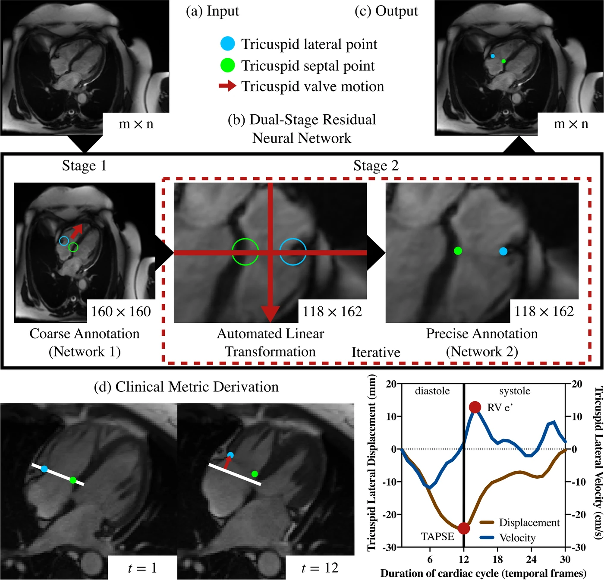
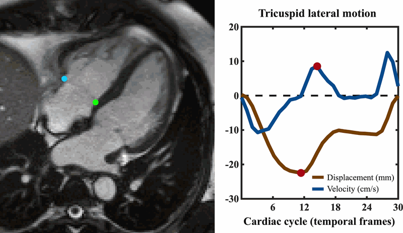
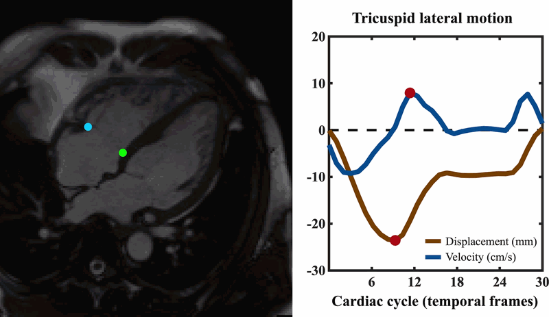

# TVnet

Automated time-resolved tracking of the tricuspid valve plane in four-chamber long-axis
cine MRI, and derivation of TAPSE and RV e′.

Gonzales RA, Lamy J, Seemann F, Heiberg E, Onofrey JA, Peters DC. *TVnet: Automated
Time-Resolved Tracking of the Tricuspid Valve Plane in MRI Long-Axis Cine Images with a
Dual-Stage Deep Learning Pipeline.* MICCAI 2021.
[doi:10.1007/978-3-030-87231-1_55](https://doi.org/10.1007/978-3-030-87231-1_55)



Stage 1 locates the valve coarsely on the whole frame. Those points define a linear
transformation to a standard resolution, orientation and crop, on which stage 2 predicts
precisely; the result is mapped back to the original image. Stage 2 is applied twice.

|  |  |
|---|---|

Tracking across one cardiac cycle in two subjects, with the lateral displacement and
velocity curves. TAPSE is the largest displacement, RV e′ the second peak of the velocity.

## Two implementations

Both carry their own weights and read the same input, and both return one row per frame,
`[row_septal, col_septal, row_lateral, col_lateral]`, in the pixel coordinates of the input
image and 1-based.

### MATLAB — `matlab/`

The networks as trained for the paper.

```matlab
addpath('matlab');
use_gpu = true;
load(fullfile('matlab','models','TVnet_4ch_1st.mat'), 'TVnet_4ch_1st');
load(fullfile('matlab','models','TVnet_4ch_2nd.mat'), 'TVnet_4ch_2nd');
[IM, Rxy, time_vector] = TVnet_functions('load_dicom_data', '4ch_data_sample');
TV = TVnet_functions('pipeline', IM, Rxy, TVnet_4ch_1st, TVnet_4ch_2nd, use_gpu);
```

`matlab/example.m` runs this and animates the result.

### PyTorch — `python/`

A port of the same method, with the optimized weights in `python/weights/`.

```bash
cd python
pip install -r requirements.txt
python predict.py --input ../4ch_data_sample --out landmarks.csv --clinical
```

`--input` takes a directory of single-frame DICOMs, or a `.npy` array of shape
`(rows, cols, frames)` with `--spacing ROW_MM COL_MM`. Add `--device cpu` if there is no
GPU, and `--stage1` / `--stage2` to use checkpoints other than the bundled ones.

## Accuracy

Mean Euclidean error of the two points, in mm, on the 28-subject test set (840 frames),
by number of stages applied.

| | 1 | 1+2 | 1+2+2 | TAPSE ICC |
|---|---|---|---|---|
| TVnet, as published | 4.01 | 2.61 | **2.44** | 0.94 |
| PyTorch, faithful | 3.91 | 3.00 | 2.70 | 0.95 |
| PyTorch, optimized | 3.77 | 2.72 | 2.56 | 0.94 |

Inter-observer variability on the same set is 2.92 mm. *Faithful* reproduces the published
method step for step. *Optimized* changes the input handling for generalizability: a square
input at a fixed millimeter scale regardless of field of view, augmentation redrawn every
epoch, and a single continuous standardization whose orientation is taken from the DICOM
header rather than from predicted motion.

## Data

The 140-subject study dataset is not distributed. `4ch_data_sample/` is one anonymized
four-chamber cine, 30 frames, included so the commands above run as they are.

## Citation

```bibtex
@inproceedings{gonzales2021tvnet,
  title     = {TVnet: Automated Time-Resolved Tracking of the Tricuspid Valve Plane
               in MRI Long-Axis Cine Images with a Dual-Stage Deep Learning Pipeline},
  author    = {Gonzales, Ricardo A. and Lamy, J{\'e}r{\^o}me and Seemann, Felicia and
               Heiberg, Einar and Onofrey, John A. and Peters, Dana C.},
  booktitle = {MICCAI 2021},
  series    = {LNCS}, volume = {12906}, pages = {567--576}, year = {2021},
  doi       = {10.1007/978-3-030-87231-1_55}
}
```

Also available as a plug-in for [Segment](http://segment.heiberg.se).

Released under the [MIT License](LICENSE). The PyTorch networks are initialized from
torchvision's ImageNet ResNet-50 weights (BSD-3-Clause).
